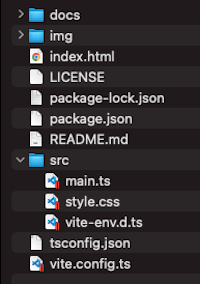

# cesium-starter


Start Cesium easily.  
- [Cesium v1.93.0](https://github.com/CesiumGS/cesium)
- [webpack v5.49.0](https://webpack.js.org)  
- node v16.10.0
- npm v7.24.0

<br>

## Usage



<br>

Install package

```bash
npm install
```

<br>

Add link to widgets.css

/node_modules/cesium/package.json

```json
"exports": {
    "./package.json": "./package.json",
    ".": {
        "require": "./index.cjs",
        "import": "./Source/Cesium.js"
    },
    "./Build/Cesium/Widgets/widgets.css": "./Build/Cesium/Widgets/widgets.css"
},
```

<br>

build

```bash
npm run build
```

<br>

dev

```bash
npm run dev
```

---

<br>
<br>


<br>

## License
MIT

Copyright (c) 2022 Yasunori Kirimoto

<br>

---

<br>

### Japanese

<br>

# Cesium スターター


Cesiumを手軽に始める
- [Cesium v1.93.0](https://github.com/CesiumGS/cesium)
- [webpack v5.49.0](https://webpack.js.org)  
- node v16.10.0
- npm v7.24.0

<br>

##  使用方法


<br>

パッケージインストール

```bash
npm install
```

<br>

widgets.cssのリンクを追加

/node_modules/cesium/package.json

```json
"exports": {
    "./package.json": "./package.json",
    ".": {
        "require": "./index.cjs",
        "import": "./Source/Cesium.js"
    },
    "./Build/Cesium/Widgets/widgets.css": "./Build/Cesium/Widgets/widgets.css"
},
```


<br>

ビルド

```bash
npm run build
```

<br>

開発

```bash
npm run dev
```

<br>
<br>


<br>

## ライセンス
MIT

Copyright (c) 2022 Yasunori Kirimoto

<br>
